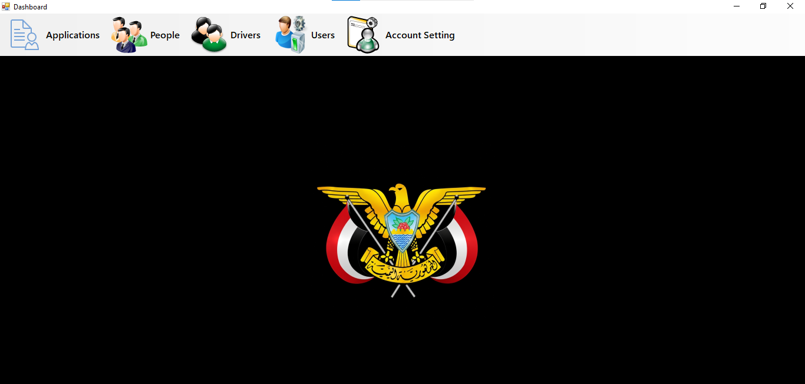
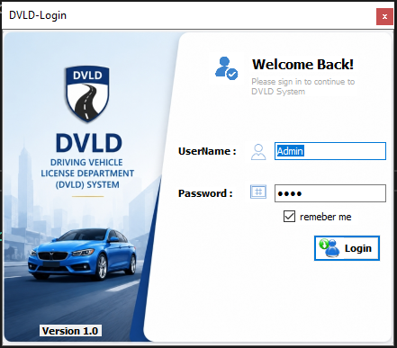
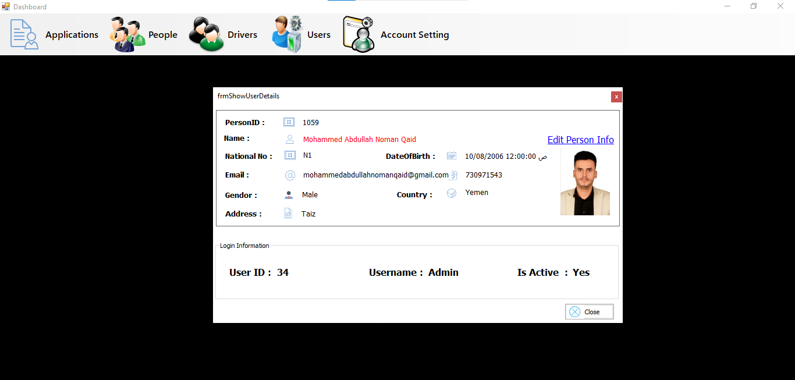
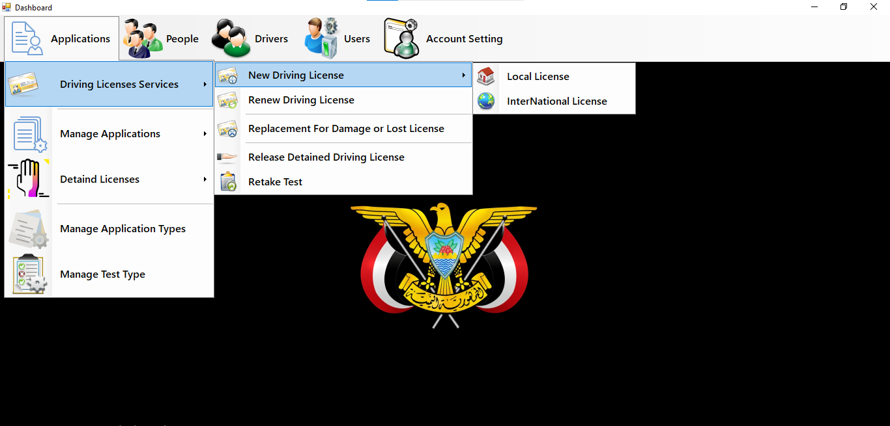
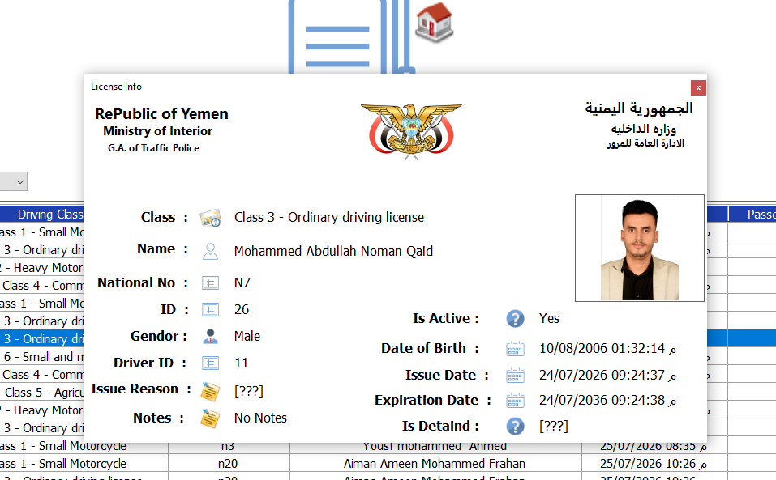
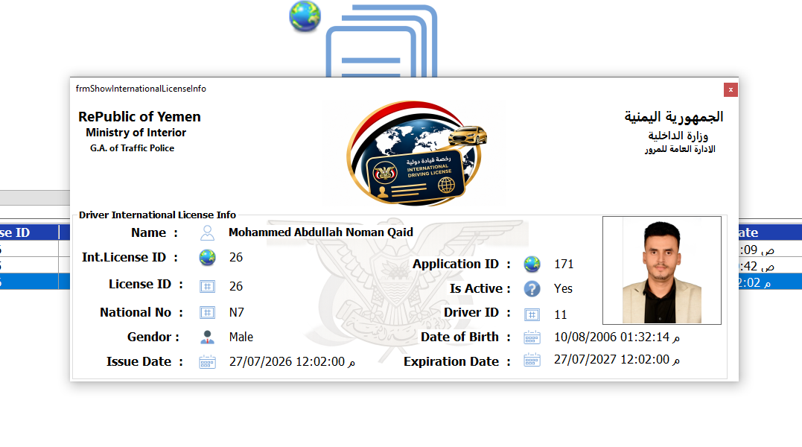
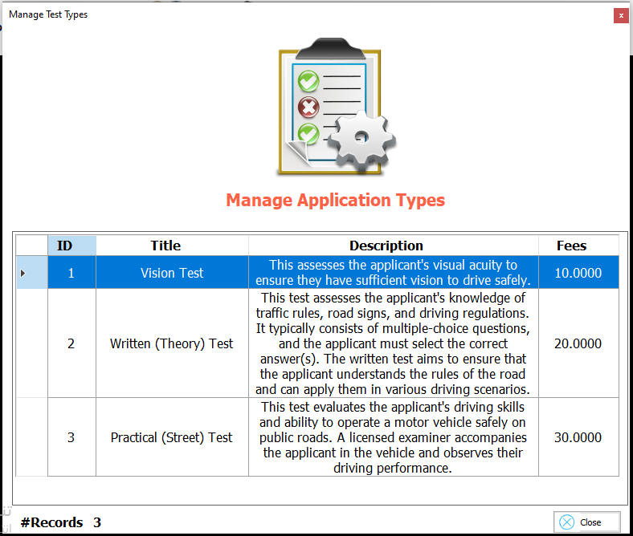

<div align="center">

# 🚗 DVLD — Driving & Vehicle License Department

### Driving & Vehicle License Department Management System

A desktop application developed with **C# and .NET Framework**, designed to manage the core entities and operations of a Driving & Vehicle License Department using a **Three-Tier Architecture**.

<br>

[](https://learn.microsoft.com/dotnet/csharp/)
[](https://dotnet.microsoft.com/)
[](https://learn.microsoft.com/dotnet/desktop/winforms/)
[](https://www.microsoft.com/sql-server)
[](#-concepts-applied)
[](#-architecture)

<br>

[📖 About](#-about-the-project) ·
[🎯 Goals](#-project-goals) ·
[✨ Features](#-key-features) ·
[🏗️ Architecture](#️-architecture) ·
[🖥️ Screenshots](#️-screenshots) ·
[🛠️ Technologies](#️-technologies) ·
[📂 Structure](#-project-structure) ·
[🚀 Setup](#-getting-started)
<a href="#-timeline">📅 Timeline</a>

</div>

---

<div align="center">

## 🖥️ Application Preview



<br>

### DVLD Dashboard

The main dashboard provides access to the core areas of the DVLD system.

<br>

[📸 View All Screenshots](Screenshots)

</div>

---

# 📖 About The Project

**DVLD — Driving & Vehicle License Department** is a desktop management application developed using **C#**, **.NET Framework 4.7.2**, **Windows Forms**, and **SQL Server**.

The project is designed using a **Three-Tier Architecture**, separating the application into three main layers:

- 🖥️ **Presentation Layer**
- ⚙️ **Business Logic Layer**
- 🗄️ **Data Access Layer**

The main purpose of the project is to apply Object-Oriented Programming and layered software architecture concepts in a practical desktop application.

By separating the user interface, business logic, and database operations, the project provides a clear and organized structure that makes the system easier to understand, maintain, and extend.

---

# 🎯 Project Goals

The project was developed with the following goals:

- Apply **Object-Oriented Programming** in a real-world style application.
- Practice building a multi-project Visual Studio solution.
- Separate the user interface from business logic.
- Separate business logic from database operations.
- Build reusable Business Layer and Data Access Layer classes.
- Organize the system into independent functional modules.
- Practice working with SQL Server from a dedicated Data Access Layer.
- Apply the principles of **Separation of Concerns**.
- Build a maintainable and scalable project structure.

---

# ✨ Key Features

## 👤 People Management

The system contains a dedicated People module for managing person-related information.

The Presentation, Business Logic, and Data Access layers each contain components related to people management.

---

## 👥 User Management

The Users module handles system-user related operations.

It is represented across the application layers through dedicated user components.

---

## 🚘 Drivers Management

The Drivers module provides functionality related to driver records and their associated information.

---

## 📋 Applications

The project contains a dedicated Applications module for application-related operations.

The Business Layer includes application-related classes and application types, while the Data Access Layer contains the corresponding database operations.

### Application Types

The Business Layer includes application types such as:

- New Application
- Renewal Application
- Replacement for Lost License
- Replacement for Damaged License
- Release of Detained License
- New International License
- Retake Test

### Application Status

Applications can be represented by different states, including:

- `New`
- `Canceled`
- `Completed`

---

## 🧪 Tests & Test Appointments

The project contains dedicated components for tests and test appointments.

### Includes

- Test Types
- Tests
- Test Appointments

The Business Layer contains dedicated classes for these areas, while the Data Access Layer provides their corresponding data operations.

---

## 🪪 Licenses

The License module contains components for managing driving licenses and license classes.

It includes dedicated Business Layer and Data Access Layer classes.

---

## 🌍 International Licenses

The project includes dedicated components for international driving licenses.

```text
Business Layer
└── clsInternationalLicense

Data Access Layer
└── clsInternationalLicenseData
```

---

## ⚠️ Detained Licenses

The project contains dedicated components for detained-license operations.

```text
Business Layer
└── clsDetaind

Data Access Layer
└── clsDetaindData
```

---

# 🔄 Main Application Relationships

The main domain relationships can be represented conceptually as:

```text
Person
   │
   ▼
Application
   │
   ├──────────────► Application Type
   │
   ▼
Driver
   │
   ▼
License
   │
   ├──────────────► License Class
   │
   └──────────────► International License
```

Testing-related components are organized separately:

```text
Application
     │
     ▼
Test Appointment
     │
     ▼
Test
     │
     ▼
Test Type
```

This organization allows each major domain concept to have its own Business and Data Access components.

---

# 🏗️ Architecture

The project follows a **Three-Tier Architecture**.

```text
┌──────────────────────────────────────────────┐
│              🖥️ PRESENTATION               │
│                    DVLD                      │
│                                              │
│       Windows Forms • User Interaction      │
└──────────────────────┬───────────────────────┘
                       │
                       ▼
┌──────────────────────────────────────────────┐
│             ⚙️ BUSINESS LOGIC               │
│              DVLD_BussinseLayer             │
│                                              │
│      Business Rules • Domain Operations     │
└──────────────────────┬───────────────────────┘
                       │
                       ▼
┌──────────────────────────────────────────────┐
│              🗄️ DATA ACCESS                 │
│             DVLD_DataAccessLayer            │
│                                              │
│       Database Access • Data Operations     │
└──────────────────────┬───────────────────────┘
                       │
                       ▼
                 💾 SQL Server
```

---

## 🖥️ Presentation Layer

### `DVLD`

The Presentation Layer is responsible for the graphical user interface and interaction with the user.

Main areas include:

```text
DVLD
│
├── Applications
├── Drivers
├── Global Class
├── License
├── Login
├── People
├── Tests
├── Users
├── Properties
└── Resources
```

The project also contains the main application entry point and dashboard:

```text
Program.cs
frmDashboard.cs
frmDashboard.Designer.cs
frmDashboard.resx
```

---

## ⚙️ Business Logic Layer

### `DVLD_BussinseLayer`

The Business Logic Layer contains the application's domain and business classes.

Main components include:

```text
clsApplications
clsApplicationsTypes
clsBPeople
clsCountry
clsDetaind
clsDrivers
clsInitialize
clsInternationalLicense
clsLicense
clsLicenseClass
clsLocalDrivingLicenseApplication
clsTest
clsTestAppointment
clsTestTypes
clsUsers
```

The Business Layer communicates with the Data Access Layer to perform data-related operations while keeping business logic separate from the user interface.

---

## 🗄️ Data Access Layer

### `DVLD_DataAccessLayer`

The Data Access Layer is responsible for database communication and data operations.

Main components include:

```text
clsApllicationTypesData
clsApplicationsData
clsConnectionString
clsCountryData
clsDatabaseInitializer
clsDetaindData
clsDriversData
clsInternationalLicenseData
clsLicenseClassData
clsLicenseData
clsLocalDrivingLicenseApplicationData
clsPeople
clsTestData
clsTestAppointmentData
clsTestTypesData
clsUserData
```

The layer also contains dedicated components for connection configuration and database initialization.

---

# 🔗 Layer Communication

The communication between the application layers follows this direction:

```text
                    USER
                     │
                     ▼
          ┌─────────────────────┐
          │  Presentation Layer │
          │        DVLD         │
          └──────────┬──────────┘
                     │
                     ▼
          ┌─────────────────────┐
          │  Business Layer     │
          │ DVLD_BussinseLayer  │
          └──────────┬──────────┘
                     │
                     ▼
          ┌─────────────────────┐
          │ Data Access Layer   │
          │ DVLD_DataAccess...  │
          └──────────┬──────────┘
                     │
                     ▼
                SQL Server
```

This architecture keeps each layer focused on its own responsibility.

---

# 🗄️ Database & Data Access

The project contains a dedicated Data Access Layer for database communication.

The database connection configuration is handled through:

```text
DVLD_DataAccessLayer
└── clsConnectionString.cs
```

The Data Access Layer also contains:

```text
clsDatabaseInitializer.cs
```

along with dedicated data-access classes for the application's main entities.

This design prevents database operations from being directly mixed with the Presentation Layer.

---

# 🖥️ Screenshots

Explore the main interfaces of the DVLD application.

<div align="center">

### 📊 Dashboard


<br>

<sub><b>Main Dashboard</b> — Central interface for navigating the system.</sub>

</div>

<br>

<table>
<tr>
<td width="50%" align="center">

### 🔐 Login



<sub>Application login interface.</sub>

</td>

<td width="50%" align="center">

### 👤 Current User



<sub>Current user information.</sub>

</td>
</tr>

<tr>
<td width="50%" align="center">

### 📋 Dashboard Features



<sub>Dashboard functionality and navigation.</sub>

</td>

<td width="50%" align="center">

### 🪪 Local Driving License



<sub>Local driving license interface.</sub>

</td>
</tr>

<tr>
<td width="50%" align="center">

### 🌍 International License



<sub>International license interface.</sub>

</td>

<td width="50%" align="center">

### 🧪 Test Types



<sub>Test type management interface.</sub>

</td>
</tr>
</table>

<br>

<div align="center">

📸 **[View the complete Screenshots Gallery](Screenshots)**

</div>

---

# 🛠️ Technologies

| Technology | Purpose |
|:--|:--|
| **C#** | Main programming language |
| **.NET Framework 4.7.2** | Application framework |
| **Windows Forms** | Desktop user interface |
| **SQL Server** | Relational database |
| **System.Data** | Database-related .NET functionality |
| **OOP** | Application and domain design |
| **Three-Tier Architecture** | Separation of responsibilities |
| **Visual Studio** | Development environment |
| **Git & GitHub** | Version control and repository hosting |

---

# 🧠 Concepts Applied

## Programming Concepts

- Object-Oriented Programming
- Classes & Objects
- Encapsulation
- Abstraction
- Properties
- Constructors
- Enums
- Static Members
- Reusable Components

## Architecture Concepts

- Three-Tier Architecture
- Separation of Concerns
- Layered Design
- Business Logic Separation
- Data Access Separation
- Project-to-Project References

## Database Concepts

- SQL Server
- Database Connections
- Data Access Classes
- CRUD Operations
- Relational Data Handling

## Desktop Development

- Windows Forms
- Forms & Controls
- User Interaction
- Input Handling
- Domain-Oriented Design

---

# 📂 Project Structure

The repository is organized into three primary projects:

```text
DVLD-v1.0.0/
│
├── 📁 DVLD/
│   │
│   ├── 📁 Applications/
│   ├── 📁 Drivers/
│   ├── 📁 Global Class/
│   ├── 📁 License/
│   ├── 📁 Login/
│   ├── 📁 People/
│   ├── 📁 Properties/
│   ├── 📁 Resources/
│   ├── 📁 Tests/
│   ├── 📁 Users/
│   │
│   ├── 📄 App.config
│   ├── 📄 Program.cs
│   ├── 📄 frmDashboard.cs
│   ├── 📄 frmDashboard.Designer.cs
│   ├── 📄 frmDashboard.resx
│   └── 📄 PresentationLayer.csproj
│
├── 📁 DVLD_BussinseLayer/
│   │
│   ├── 📄 clsApplications.cs
│   ├── 📄 clsApplicationsTypes.cs
│   ├── 📄 clsBPeople.cs
│   ├── 📄 clsCountry.cs
│   ├── 📄 clsDetaind.cs
│   ├── 📄 clsDrivers.cs
│   ├── 📄 clsInitialize.cs
│   ├── 📄 clsInternationalLicense.cs
│   ├── 📄 clsLicense.cs
│   ├── 📄 clsLicenseClass.cs
│   ├── 📄 clsLocalDrivingLicenseApplication.cs
│   ├── 📄 clsTest.cs
│   ├── 📄 clsTestAppointment.cs
│   ├── 📄 clsTestTypes.cs
│   ├── 📄 clsUsers.cs
│   └── 📄 BussinseLayer.csproj
│
├── 📁 DVLD_DataAccessLayer/
│   │
│   ├── 📄 clsApllicationTypesData.cs
│   ├── 📄 clsApplicationsData.cs
│   ├── 📄 clsConnectionString.cs
│   ├── 📄 clsCountryData.cs
│   ├── 📄 clsDatabaseInitializer.cs
│   ├── 📄 clsDetaindData.cs
│   ├── 📄 clsDriversData.cs
│   ├── 📄 clsInternationalLicenseData.cs
│   ├── 📄 clsLicenseClassData.cs
│   ├── 📄 clsLicenseData.cs
│   ├── 📄 clsLocalDrivingLicenseApplicationData.cs
│   ├── 📄 clsPeople.cs
│   ├── 📄 clsTestData.cs
│   ├── 📄 clsTestAppointmentData.cs
│   ├── 📄 clsTestTypesData.cs
│   ├── 📄 clsUserData.cs
│   └── 📄 DataAccessLayer.csproj
│
├── 📁 Screenshots/
│   ├── 🖼️ Current-User-Screen.png
│   ├── 🖼️ Dashboard-Feature.png
│   ├── 🖼️ Dashboard-Screen.png
│   ├── 🖼️ International_License.png
│   ├── 🖼️ Local-Driving-License.png
│   ├── 🖼️ Login-Screen.png
│   └── 🖼️ Manage-Test-Type-Screen.png
│
├── 📄 DVLD.sln
└── 📄 .gitignore
```

> The structure focuses on the main source organization and architectural layers. Build-generated directories such as `bin` and `obj` are intentionally omitted.

---

# 🚀 Getting Started

## Prerequisites

Before running the project, make sure you have:

- Windows
- Visual Studio
- .NET Framework 4.7.2
- SQL Server
- SQL Server Management Studio

---

## 1️⃣ Clone the Repository

```bash
git clone https://github.com/mohammedabdullahnomanqaid-maker/DVLD-v1.0.0.git
```

Then:

```bash
cd DVLD-v1.0.0
```

---

## 2️⃣ Open the Solution

Open:

```text
DVLD.sln
```

using Visual Studio.

The solution contains:

```text
DVLD
DVLD_BussinseLayer
DVLD_DataAccessLayer
```

---

## 3️⃣ Configure the Database

Review the database connection configuration located in:

```text
DVLD_DataAccessLayer
└── clsConnectionString.cs
```

Configure the connection according to your local SQL Server environment.

> ⚠️ Never publish real production credentials or passwords in a public repository.

---

## 4️⃣ Build the Solution

From Visual Studio:

```text
Build
   ↓
Rebuild Solution
```

Make sure all projects build successfully.

---

## 5️⃣ Run the Application

Set:

```text
DVLD
```

as the startup project and run the application.

---

## 📅 Timeline

| Version | Start Date | End Date | Language |
|:---:|:---:|:---:|:---:|
| **v1.0.0** | 2026/07/04 | 2026/08/04 | C# |

---

# 📈 Version

## `v1.0.0`

This repository represents **DVLD Version 1.0.0**.

The project provides a structured foundation for a Driving & Vehicle License Department management system using a Three-Tier Architecture.

Future versions can build upon this foundation through additional features, improvements, refactoring, and enhanced documentation.

---

# 🔮 Future Improvements

Potential future improvements include:

- Further UI/UX improvements
- Additional validation
- More comprehensive error handling
- Improved database configuration
- Additional testing
- Further code refactoring
- Improved documentation
- Additional system functionality

---

# 🎓 Learning Outcomes

This project provides practical experience with:

- Building a multi-layer desktop application
- Applying Object-Oriented Programming
- Designing reusable Business Layer classes
- Separating database operations into a Data Access Layer
- Working with SQL Server
- Organizing a large Visual Studio solution
- Managing project dependencies
- Designing domain-oriented components
- Working with Git and GitHub
- Applying software architecture principles

---

# 👨‍💻 Author

<div align="center">

### Mohammed Abdullah Noman Qaid Mohammed

**Computer Science Student — Taiz University**

<br>

[](https://www.linkedin.com/in/dev-moh-noman/)
[](mailto:mohammedabdullahnomanqaid@gmail.com)

</div>

---

# ⭐ Support

If you find this project useful or interesting, consider giving the repository a ⭐ on GitHub.

Your feedback and suggestions are always welcome.

---

<div align="center">

**DVLD — Driving & Vehicle License Department**

Built with **C# · .NET Framework · Windows Forms · SQL Server · OOP · Three-Tier Architecture**

</div>
